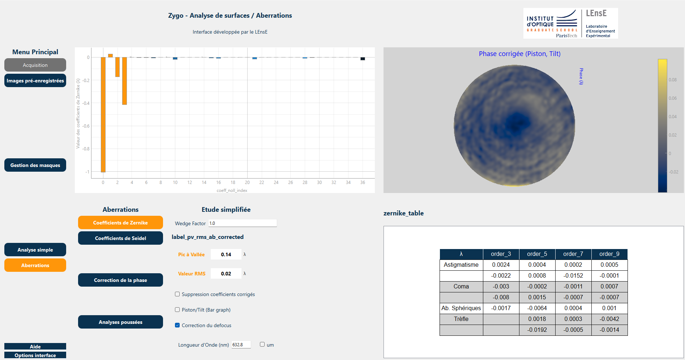

.. Zygo GUI documentation master file, created by Julien VILLEMEJANE / 11 may 2025

Aberrations Labwork GUI's documentation
#######################################

.. warning::
   This application and its documentation website are still works in progress

**Aberrations GUI** is a complete graphical user interface (based on PyQt6) dedicated to labworks about **interferometric tests** and **aberrations identification** at the Experimental Teaching Laboratory (LEnsE) of the Institut d'Optique Graduate School (IOGS).

	
	View of the interface (aberrations mode).

The GitHub repository of this project : `Aberrations GUI <https://github.com/IOGS-LEnsE-ressources/aberrations-gui>`_

Labworks subject are available at the following addresses :

- `Interferometric test - First year <https://lense.institutoptique.fr/tp-controles-interferometriques/>`_
- `Aberrations - Second year <https://lense.institutoptique.fr/ressources/Annee2/TP_Photonique/S8-2425-Aberrations.EN.pdf>`_

About the LEnsE
***************

This is a test.

.. raw:: html

	<a href="https://lense.institutoptique.fr/mine/nucleo-bibliotheques-de-fonctions/"><i class="fa fa-github"></i> Bibliothèques MBED 6</a>

